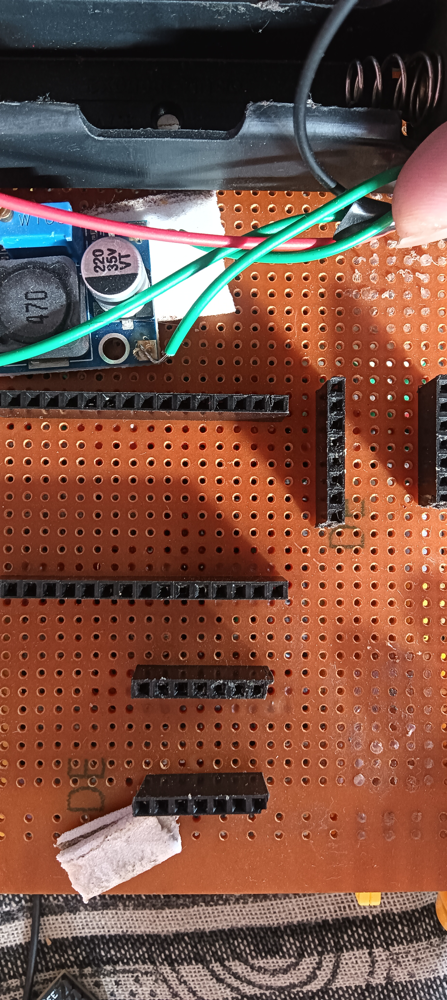
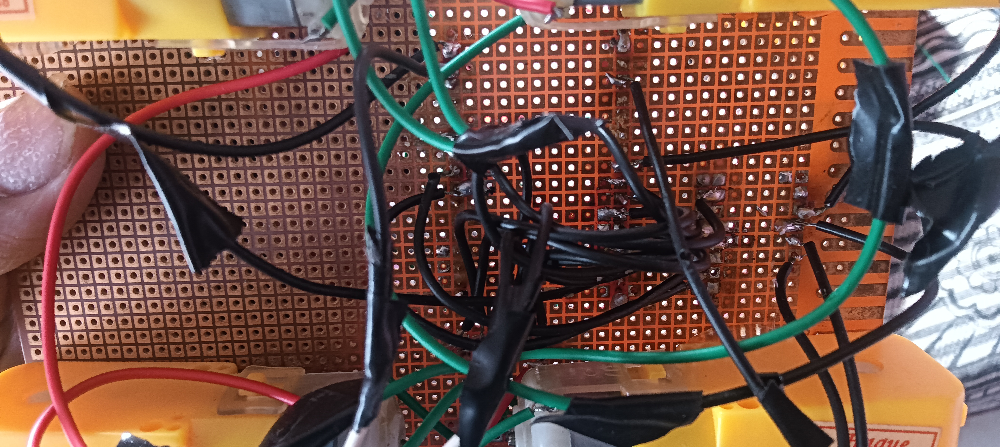

# Esp-now-Gesture-control-car
A normal car controlled using hand gestures with the help of mpu6050 and that uses esp-now protocol for wireless communication.
I have made the entire circuit of my zero pcb now and will upgrade it to a professional pcb and a proper case after testing, as i tight on budget.
I have figured out what all the parts I require and the pin configuration. 

🛠️ Bill of Materials (BOM)
All components were sourced keeping the budget in mind, primarily from Robu.in.
| Component | Description | Qty | Approx. Price (INR) |
|---|---|---|---|
| ESP32 Dev Board | Brain of the car and the controller | 2 | ₹782 |
| DRV8833 Driver | Dual-channel motor driver (Tiny & Efficient) | 2 | ₹100 |
| MPU6050 | 6-Axis Accelerometer + Gyroscope | 1 | ₹179  |
| Mecanum Wheels | 60mm wheels for omnidirectional movement (will buy from offline market as its very costly online| 4 | ₹1,000 |
| BO Motors | 150 RPM Yellow motors | 4 | ₹172 |
| 18650 Li-ion Cells | Power source for the Car | 2 | ₹128 |
| Li-Po Battery | Lightweight 3.7V battery for hand controller | 1 | ₹150 |
| MT3608 Step-up | To boost voltage for the ESP32 | 1 | ₹40 |
| LM2596 Step-down | To regulate voltage for stable operation | 1 | ₹36 |
| Misc. | Zero PCB, Header pins, Jumper wires | - | ₹150 |
| Total Cost |  |  | ₹2,737 |

I will need some extra money after testing and trial to order a pcb and a case.

📝 Component Selection Logic
 * Why ESP-NOW? I chose this over Bluetooth for near-zero latency and better range without needing a router.
 * Why DRV8833? The body of my car is small. These drivers are much smaller than the bulky L298N and don't get as hot.
 * Why Mecanum Wheels? Regular wheels can only go front and back. These allow the car to slide sideways (strafing), making the gesture control look much more advanced.
 * Why Zero PCB? Shipping a custom PCB to India is very expensive. I did "Jugaad" with a Zero PCB to keep the project cost-effective.
 * # ESP-NOW Gesture Controlled Mecanum Car

## 📸 Project Gallery
| :---: | :---: |
|  |  |

---
